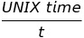
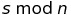
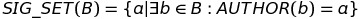
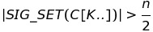
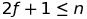

## Simple Summary
Aura is a basic consensus algorithm where only a defined set of users is able to _mine_ blocks.

## Abstract
Aura (_Authority Round_) is a proof-of-authority blockchain consensus algorithm where only a defined set of validators is allowed to seal blocks. It's a protocol where instead of miners racing to find a solution to a difficult problem, authorized signers can create new blocks in a round-robin process at defined intervals.

Aura is the consensus engine pioneered by [Parity Technologies](https://parity.io) in 2016 and used to power the [public Kovan testnet](https://medium.com/@Digix/announcing-kovan-a-stable-ethereum-public-testnet-10ac7cb6c85f) which was established after the [Ropsten spam-attacks](https://ethereum.stackexchange.com/questions/12477/ropsten-testnet-is-under-kind-of-attack-what-can-we-do) in 2017. In addition, public value-bearing networks, such as [POA Network](https://poa.network/), are based on the Aura protocol today.

This document is _informational_ to summarize all available technical specification of the consensus engine to allow other client developer teams an overview, a place for feedback, and potentially the foundation to implement this in other code bases.

## Motivation
Networks not bearing any value can not be sufficiently secured with proof-of-work or proof-of-stake. This is especially true for test networks that are supposed to be a reliable platform for developers to deploy and test their applications. Therefore, a proof-of-authority scheme is proposed which provides sufficient resistance against network attacks in testnets without attached value.

## Specification
The following sections technically specifies the Authority Round consensus protocol.

### Parameters
  - `n`, the number of validator nodes
  - `f`, the number of faulty validator nodes
  - `s`, the step ID
  - `t`, the step duration in seconds

### Authority Round Description
Time is divided into discrete steps of duration `t`, determined by:



At each step `s`, a _primary_ will be assigned. Only the primary at a step may issue a block. It is misbehavior to produce more than one block per step or to produce a block out of turn.

The primary for a step `s` is the node with index:



The protocol contains a chain scoring rule `SCORE(C)` for a given chain `C`.

On each step, each honest node will propagate the chain with the highest score it knows about to all other nodes. Honest primaries will only issue blocks on top of the best chain they are aware of during their turn.

### Finality
Under the assumption of a synchronous network which propagates messages within the step duration `t`, let `SIG_SET(B)` be the set of signatures from all authors in the set of blocks `B`:



If there is a valid chain `C` ending with `C[K..]`, where:



then `C[K]` and all of its ancestors are finalized.

This definition of finality stems from a simple majority vote. In this setting:



so the faulty nodes cannot finalize a block all on their own.

### Configuration
This consensus requires a _Validator Set_ to be specified, which determines the list of `n` blockchain addresses at each height `h` which participate in the consensus. Validators are a group of accounts which are allowed to participate in the consensus, they validate the transactions and blocks to later sign messages about them. The validator set can be specified in a number of different ways.

#### Immutable list
A simple list of addresses specified at genesis, i.e.:

```json
"validators": {
    "list": [
        "0x0082a7bf6aaadab094061747872243059c3c6a07",
        "0x00faa37564140c1a5e96095f05466b9f73441e44"
    ]
}
```

#### Contracts
The list can be also a part of the blockchain state by being stored in an Ethereum contract.

It is best to include the contract in the genesis placing the bytecode as a "constructor" in the "accounts" field. If the constructor takes arguments they must be encoded and appended to the contract bytecode (using e.g. [ethabi](https://github.com/paritytech/ethabi)). Also if the contract initializes any address with `msg.sender` (for example as a contract owner) you must take into account that when defining the contract in genesis, `msg.sender` will be set to the system address (`SYSTEM_ADDRESS`: `2^160 - 2`).

Example contracts can be found here with the [contract used on Kovan Network](https://github.com/parity-contracts/kovan-validator-set).

##### Non-reporting contract
A simple validator contract has to have the following interface:
```json
[{"constant":false,"inputs":[],"name":"finalizeChange","outputs":[],"payable":false,"type":"function"},{"constant":true,"inputs":[],"name":"getValidators","outputs":[{"name":"_validators","type":"address[]"}],"payable":false,"type":"function"},{"anonymous":false,"inputs":[{"indexed":true,"name":"_parent_hash","type":"bytes32"},{"indexed":false,"name":"_new_set","type":"address[]"}],"name":"InitiateChange","type":"event"}]
```

which corresponds to this Solidity contract definition:
```solidity
contract ValidatorSet {
    /// Issue this log event to signal a desired change in validator set.
    /// This will not lead to a change in active validator set until
    /// finalizeChange is called.
    ///
    /// Only the last log event of any block can take effect.
    /// If a signal is issued while another is being finalized it may never
    /// take effect.
    ///
    /// _parent_hash here should be the parent block hash, or the
    /// signal will not be recognized.
    event InitiateChange(bytes32 indexed _parent_hash, address[] _new_set);

    /// Get current validator set (last enacted or initial if no changes ever made)
    function getValidators() constant returns (address[] _validators);

    /// Called when an initiated change reaches finality and is activated.
    /// Only valid when msg.sender == SUPER_USER (EIP96, 2**160 - 2)
    ///
    /// Also called when the contract is first enabled for consensus. In this case,
    /// the "change" finalized is the activation of the initial set.
    function finalizeChange();
}
```

There is a notion of an "active" validator set: this is the set of the most recently finalized signal (InitiateChange event). The initial set is

The function `getValidators` should always return the active set or the initial set if the contract hasn't been activated yet.
Switching the set should be done by issuing a `InitiateChange` event with the parent block hash and new set, storing the pending set, and then waiting for call to `finalizeChange` (by the `SYSTEM_ADDRESS`: `2^160 - 2`) before setting the active set to the pending set. This mechanism is used to ensure that the previous validator set "signs off" on the changes before activation, leading to full security in situations like warp and light sync, where state transitions aren't checked.

Other than these restrictions, the switching rules are fully determined by the contract implementing that method. The spec should contain the contract address:

```json
"validators": {
    "safeContract": "0x0000000000000000000000000000000000000005"
}
```

##### Reporting contract
Sometimes one might want to automatically take action when one of the validators behaves badly. The definition of bad behaviour depends on a consensus engine and there are two types of bad behaviour:
- benign misbehaviour
- malicious misbehaviour

Benign misbehaviour in Aura may be simply not receiving a block from a designated primary, while malicious misbehaviour would be releasing two different blocks for the same step.

This type of contract can listen to misbehaviour reports from the consensus engine and decide what are the consequences for the validators.

The correct interface is:
```json
[{"constant":false,"inputs":[],"name":"finalizeChange","outputs":[],"payable":false,"type":"function"},{"constant":true,"inputs":[],"name":"getValidators","outputs":[{"name":"_validators","type":"address[]"}],"payable":false,"type":"function"},{"constant":false,"inputs":[{"name":"validator","type":"address"},{"name":"blockNumber","type":"uint256"},{"name":"proof","type":"bytes"}],"name":"reportMalicious","outputs":[],"payable":false,"type":"function"},{"constant":false,"inputs":[{"name":"validator","type":"address"},{"name":"blockNumber","type":"uint256"}],"name":"reportBenign","outputs":[],"payable":false,"type":"function"},{"anonymous":false,"inputs":[{"indexed":true,"name":"_parent_hash","type":"bytes32"},{"indexed":false,"name":"_new_set","type":"address[]"}],"name":"InitiateChange","type":"event"}]
```

which corresponds to this Solidity contract definition:
```solidity
contract ReportingValidatorSet {
    // all same as ValidatorSet
    event InitiateChange(bytes32 indexed _parent_hash, address[] _new_set);

    function getValidators() constant returns (address[] _validators);
    function finalizeChange();

    // Reporting functions: operate on current validator set.
    // malicious behavior requires proof, which will vary by engine.

    function reportBenign(address validator, uint256 blockNumber);
    function reportMalicious(address validator, uint256 blockNumber, bytes proof);
}
```

`InitiateChange`, `getValidators` and `finalizeChange` should function exactly as in a non-reporting contract.
There are two new functions, `reportBenign` and `reportMalicious`. Each should come with the address of a validator being reported and the block number at which misbehavior occurred. `reportMalicious` also requires a proof of malice, which is an arbitrary byte-string which different engines will set to different values. Validators will call these when they detect misbehavior.

These should function on only the current active validator set.

It is specified as:

```json
"validators": {
    "contract": "0x0000000000000000000000000000000000000005"
}
```

#### Multi set
This validator set can specify any combination of other validator sets. Switching is done based on the number of the current block. It can be useful for conducting chain forks. First set has to start at block 0.

```json
"validators": {
    "multi": {
        "0": {
            "list": [
                "0x82a978b3f5962a5b0957d9ee9eef472ee55b42f1",
                "0x7d577a597b2742b498cb5cf0c26cdcd726d39e6e"
            ]
        },
        "100": {
            "contract": "0x0000000000000000000000000000000000000005"
        }
    }
}
```

Note that transitions to a contract will not take effect immediately. Rather, they will take effect when the transition block is finalized by the previous set of validators. Again, this is to provide full security for warp and light sync.

Transitions to a fixed list will take effect immediately because regardless of whether an attacker gives a light client a transition block with an invalid state, the subsequent validator set will always be the same.

#### Limitations

Currently events emitted by the validator set contract when the engine calls `finalizeChange` are not observable. This is a limitation of how "system" transactions are implemented at the moment.

### Supplementary features
_(Optional:)_ The consensus can be run with _force-sealing_ which ensures that blocks are produced at each step `s` after step duration `t` even if there are no transactions. This is necessary for blocks to reach finality in a timely fashion. If malicious authorities are possible then force-sealing is advised, this will ensure that the correct chain is the longest (making it byzantine-fault tolerant with finality of `n * t` given no network partitions).

_(Optional:)_ In order to reach finality in a timely fashion it is necessary for the nodes to keep sealing blocks even when there are no transactions. To reduce blockchain bloat while still maintaining the same finality guarantees the nodes can sign and broadcast an `EmptyStep(s, parent_hash)` message instead of producing an empty block. All of the nodes accumulate the broadcasted empty step messages and they are included and rewarded in the next non-empty block. The empty step messages included in blocks are also taken into account for finality. The maximum number of empty steps should be limited and configurable.

_(Optional:)_ The maximum number of accepted ommers should be limited and configurable. While Ethash defaults to `2`, it's recommended to default Aura engines to a maximum of `0` ommers to avoid unnecessary chain reorgs.

## Rationale
An alternate proof-of-authority standard is [_Clique_ proposed by Péter Szilágyi in March 2017](https://github.com/ethereum/EIPs/issues/225). The Clique engine is implemented in Geth and powering the [Rinkeby test network](https://www.rinkeby.io/).

## Implementation
The Parity Ethereum client contains a [feature-complete implementation of the Aura engine](https://wiki.parity.io/Pluggable-Consensus). The public Kovan testnet can be regarded as [show-case for Aura](https://kovan-stats.parity.io/).

## Copyright
Copyright and related rights waived via [CC0](https://creativecommons.org/publicdomain/zero/1.0/).
